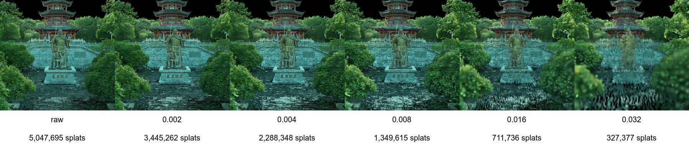

# 基于半径约束的空间抽稀与合并方案

## 1. 技术方案说明

针对 3D Gaussian Splatting（3DGS）数据在高密度区域存在大量空间冗余、传统体素抽稀方法易产生格子感与结构伪影的问题，提出一种**基于半径约束的空间抽稀与合并方案**。

该方案以 **空间距离约束** 作为核心准则，通过设定最小空间间距（半径阈值），对高斯点进行逐点筛选与合并处理。算法优先保留对视觉贡献较大的高斯点，并在其空间邻域内抑制冗余点，从而实现空间分布的均匀化。

为保证在大规模数据场景下的计算效率，引入 **哈希网格（Hash Grid）** 作为空间加速结构，将三维空间划分为边长等于半径阈值的规则单元，仅在当前单元及其相邻单元内进行近邻查询，在保证结果完整性的前提下，将计算复杂度控制在近似线性范围内。

当某一高斯点的半径邻域内已存在代表点时，其几何与属性参数将按权重合并至该代表点；若不存在，则该高斯点作为新的代表点保留。合并完成后，对高斯尺度施加上限约束，避免因多点融合导致尺度异常膨胀，从而保证渲染稳定性。

该方案不依赖规则体素边界，不引入多层级 LOD 或信息论距离度量，适用于大规模 3DGS 数据的离线抽稀与工程级优化处理。

## 2. 算法流程

**输入：**  
- 高斯点集合  
- 半径阈值 (r)

**输出：**  
- 抽稀并合并后的高斯点集合

**步骤：**

1. **重要性排序**  
   根据不透明度与局部尺度等指标对高斯点进行排序，优先处理视觉贡献较大的点。

2. **空间哈希构建**  
   将空间划分为边长为 (r) 的网格单元，并通过哈希映射建立空间索引。

3. **半径邻域判定**  
   对每个高斯点，仅在其所在网格单元及其相邻的 27 个网格单元中进行近邻搜索。

4. **抽稀与合并**  
   - 若半径 (r) 内不存在代表点，则该点作为新的代表点保留；
   - 若存在代表点，则将该点按权重合并至对应代表点。

5. **尺度约束与参数更新**  
   对合并后的高斯尺度施加上限约束，输出最终高斯集合。

## 3. 数学与公式说明

### 3.1 高斯点表示

设输入高斯点集合为：

 $$\mathcal{G} = \{ g_i \mid g_i = (\mathbf{x}_i, {\Sigma}_i, \mathbf{f}_i, \alpha_i) \}$$

其中：
- $(\mathbf{x}_i \in \mathbb{R}^3 )$ ：高斯中心位置  
- $({\Sigma}_i)$ ：尺度或协方差近似  
- $( \mathbf{f}_i)$ ：颜色或 SH 特征  
- $(\alpha_i)$ ：不透明度  

### 3.2 半径约束判定

对于高斯点 $(g_i)$，若存在代表点 $(g_j )$ 满足：

$$\|\mathbf{x}_i - \mathbf{x}_j\|_2 \le r$$

则认为两者在空间上冗余，需要执行合并操作；否则， $(g_i)$ 作为新的代表点保留。

### 3.3 权重定义

合并权重定义为：

$$
w_i = \alpha_i
$$

（工程中可扩展为 $( w_i = \alpha_i \cdot s_i )，其中 (s_i)$ 表示局部尺度因子。）

### 3.4 位置与属性合并

在基于半径约束的空间聚合过程中，多个落入同一聚合簇内的高斯点需要合并为一个具有代表性的高斯，以降低数据规模并保持整体外观一致性。合并过程在位置、特征、透明度、尺度及旋转等多个维度上进行。

#### 3.4.1 位置合并

合并后高斯点的位置采用加权质心方式计算：

$$
\mathbf{x}_{\text{new}} =
\frac{\sum_i w_i \mathbf{x}_i}{\sum_i w_i}
$$

其中：
- $\mathbf{x}_i$：第 $i$ 个高斯点的中心位置
- $w_i$：对应权重（通常与透明度或重要性相关）

#### 3.4.2 特征合并（颜色 / 球谐系数

高斯点的颜色及高阶球谐（Spherical Harmonics, SH）特征定义在线性空间中，可采用加权平均方式进行合并：

$$
\mathbf{f}_{\text{new}} = \frac{\sum_i w_i \mathbf{f}_i}{\sum_i w_i}
$$

其中 $\mathbf{f}_i$ 包括 DC 分量与高阶球谐系数。由于球谐展开定义在线性空间中，该加权平均能够保持辐射度期望的一致性。

#### 3.4.3 透明度合并

为正确描述多个高斯点在空间上的遮挡关系，透明度采用累积遮挡概率形式进行合并：

$$
\alpha_{\text{new}} = 1 - \prod_i (1 - \alpha_i)
$$

该形式等价于在对数空间中累加 $\log(1-\alpha)$，可避免线性平均造成的透明度低估。

#### 3.4.4 尺度合并

空间尺度首先由高斯中心的离散程度给出，其统计方差为：

$$
\sigma^2_{\text{pos}} = \mathbb{E}[\mathbf{x}^2] - \mathbf{x}_{\text{new}}^2
$$

在实际实现中，该期望通过加权求和形式计算，并与原始高斯尺度联合得到合并尺度：

$$
\sigma_{\text{new}}^2 = \frac{\sum_i w_i \lVert \mathbf{x}_i - \mathbf{x}_{\text{new}} \rVert^2}{\sum_i w_i} + \frac{\sum_i w_i \sigma_i^2}{\sum_i w_i}
$$

为防止尺度异常膨胀，在工程实现中引入尺度上限约束：

$$
\sigma_{\text{new}} \le k \cdot \frac{\sum_i w_i \sigma_i}{\sum_i w_i}
$$

#### 3.4.5 旋转合并 

高斯椭球的旋转采用单位四元数表示。设第 $i$ 个高斯点的旋转为：

$$
\mathbf{q}_i = (x_i, y_i, z_i, w_i)
$$

$$
\qquad \lVert \mathbf{q}_i \rVert = 1
$$

- **（1）同半球约束**

由于四元数具有符号二义性（$\mathbf{q}$ 与 $-\mathbf{q}$ 表示相同旋转），在合并前需对四元数进行同半球对齐。  
以参考四元数 $\mathbf{q}_{\mathrm{ref}}$ 为基准，对每个四元数执行：

$$
\mathbf{q}_i' =
\begin{cases}
\mathbf{q}_i, & \mathbf{q}_{\mathrm{ref}} \cdot \mathbf{q}_i \ge 0 \\
-\mathbf{q}_i, & \text{otherwise}
\end{cases}
$$

其中 $\cdot$ 表示四元数内积。

- **（2）加权四元数累加**

在完成同半球对齐后，对四元数进行加权累加：

$$ \tilde{\mathbf{q}} = \sum_i w_i \, \mathbf{q}_i'$$

其中 $w_i$ 为对应高斯点的权重。

- **（3）归一化**

通过对累加结果进行归一化，得到合并后的旋转四元数：

$$
\mathbf{q}_{\mathrm{new}} = \frac{\tilde{\mathbf{q}}}{\lVert \tilde{\mathbf{q}} \rVert}
$$

该四元数用于描述合并后高斯椭球的主轴方向。

### 3.5 哈希网格与 27 邻域

当网格单元边长设置为 $(r)$ 时，任意距离不超过 $(r)$ 的点，其网格索引在三个坐标轴方向上的偏移范围为 $([-1, 1])$。  
因此，仅需检查：

$$
3 \times 3 \times 3 = 27
$$

个相邻网格单元即可保证不遗漏任何潜在近邻点。

## 4. 计算复杂度分析

设输入点数为 (N)，抽稀后代表点数为 (M)（通常 $( M \ll N ) $）。

- **排序阶段：**  

 $$O(N \log N) $$

- **半径抽稀与合并阶段（哈希网格加速）：**  
  平均情况下，每个点仅检查常数数量的候选点：  

 $$O(N)$$

- **总体时间复杂度：**  

 $$O(N \log N)$$

- **空间复杂度：**  

$$O(N)$$

## 5. 技术效果与方案优势

### 5.1 视觉效果优势
- 消除规则体素抽稀带来的格子感  
- 抑制高密度区域高斯点的堆叠与重影  
- 保持场景结构连续性与边界稳定性  

### 5.2 工程与性能优势
- 近似线性复杂度，适合百万级甚至千万级数据  
- 哈希网格结构简单，易于 CPU / WASM / GPU 实现  
- 不依赖复杂协方差分解或 KL 距离计算，数值稳定  

### 5.3 方法通用性
- 不引入多层级 LOD，适用于单层模型优化  
- 可作为 3DGS 数据预处理、压缩与加载优化模块  
- 易于与渲染调度、流式加载等系统解耦集成  

## 6. 总结

**基于半径约束的空间抽稀与合并方案**通过空间距离抑制冗余高斯点，在不依赖规则体素划分和信息论度量的前提下，实现了高质量、可扩展的 3D Gaussian 数据抽稀方法，兼顾视觉效果与工程性能，适合在大规模 3DGS 系统中落地应用。

在此基础上，该方案还天然具备作为 **LOD（Level of Detail）构建基础单元** 的能力。通过逐级增大半径阈值 \( r \)，可在保持统一合并规则与稳定空间分布的前提下，生成一系列由“细到粗”的高斯表示层级。不同半径对应不同空间分辨率，使得每一层级均满足最小空间间距约束，避免传统体素 LOD 中常见的层级突变与结构跳变问题。

由于各层级均遵循一致的半径约束与合并策略，LOD 之间在几何形态、密度分布与视觉特征上具有良好的连续性，可与基于视距、屏幕空间误差（SSE）或调度策略的运行时系统直接对接，实现平滑、稳定且工程友好的 3DGS 多层级渲染与调度。
